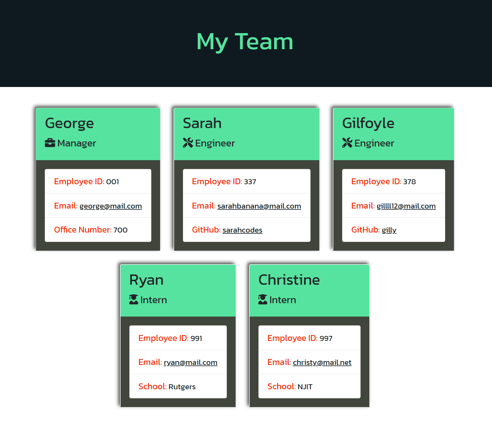

[](https://opensource.org/licenses/MIT)

# Team Profile Generator

## Description

This project utilizes object oriented programming in order to dynamically generate a team's profile with details about its members on a webpage. Through node.js, a user can invoke the application through their terminal and after some inquirer prompts, the application will create an index.html that matches the user input.

Below is a walkthrough video that will show anybody who wants to use this application how to go about doing so. It will also detail some of the features involved in this project, including validation for prompts.

## Table of Contents

* [Screenshots](#screenshots)
* [Installation](#installation)
* [Usage](#usage)
* [License](#license)
* [Tests](#tests)
* [Questions](#questions)

## Screenshots

Generated Team Profile Webpage



Application


Validation


## Installation

In order to install this application, your first step would be to clone the repo onto your local machine. Once the repo is cloned to your machine, you will need to open up your terminal and navigate to the root of this project's folder. Once you're there run this command:

```
npm install
```

## Usage

In order to use this project, be sure you are at the root of the project in your terminal/git bash. Once you're there invoke this command:

```
node index.js
```

## License

Copyright 2021 Alex Sadrgilany

Permission is hereby granted, free of charge, to any person obtaining a copy 
of this software and associated documentation files (the "Software"), to deal 
in the Software without restriction, including without limitation the rights to 
use, copy, modify, merge, publish, distribute, sublicense, and/or sell copies of the 
Software, and to permit persons to whom the Software is furnished to do so, 
subject to the following conditions:

The above copyright notice and this permission notice shall be included in all 
copies or substantial portions of the Software.

THE SOFTWARE IS PROVIDED "AS IS", WITHOUT WARRANTY OF ANY KIND, EXPRESS OR IMPLIED, 
INCLUDING BUT NOT LIMITED TO THE WARRANTIES OF MERCHANTABILITY, FITNESS FOR A 
PARTICULAR PURPOSE AND NONINFRINGEMENT. IN NO EVENT SHALL THE AUTHORS OR COPYRIGHT 
HOLDERS BE LIABLE FOR ANY CLAIM, DAMAGES OR OTHER LIABILITY, WHETHER IN AN ACTION OF 
CONTRACT, TORT OR OTHERWISE, ARISING FROM, OUT OF OR IN CONNECTION WITH THE SOFTWARE 
OR THE USE OR OTHER DEALINGS IN THE SOFTWARE.

## Tests

In order to test for this project, make sure you are at the root of the project in your terminal/git bash. Once you're there run this command (after installation instructions):

```
npm test
```

You can also ensure that the generated index.html matches the user input you give during the inquirer prompts.

## Questions

[My GitHub Profile](https://github.com/asadg7)

To reach me with questions, please email: asadrgilany7@gmail.com

